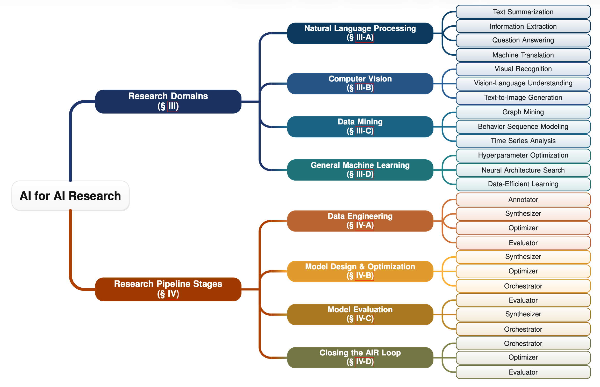

<div align="center">

# Awesome LLMs for AI Research 🤗

<p align="center">
  <a href="README_CN.md">中文</a> •
  <a href="https://ict-find-lab.github.io/Awesome-LLMs-for-AI-Research/">Website</a> •
  <a href="PDF/AI4AIR_Survey_v260601.pdf">Paper</a> •
  <a href="https://github.com/ICT-FinD-Lab/Awesome-LLMs-for-AI-Research">GitHub</a>
</p>

<p align="center">
  <a href="https://awesome.re"></a>
  
</p>


</div>

## 🎯 Overview

A curated companion repository for **AI4AIR: A Comprehensive Survey on Large Language Models for AI Research**, focusing on how LLMs support data engineering, model design and optimization, model evaluation, and closed-loop AI research automation.

## 🔥 Update Records

- **[2026/06/01]** Initial framework released with the AI4AIR survey PDF, bilingual README, and project page.
- **Coming soon:** Curated paper entries, topic tags, and resource metadata.

## 📚 Table of Contents

- [Overview](#overview)
- [Abstract](#abstract)
- [Taxonomy of AI4AIR](#taxonomy-of-ai4air)
- [Resources](#resources)
- [How to Contribute](#how-to-contribute)
- [Citation](#citation)
- [Star History](#star-history)
- [Contact](#contact)
- [Maintainers](#maintainers)

## 📄 Abstract

Language-mediated automation is beginning to complement the human-centered trial-and-error process in AI research. Among current AI tools, large language models (LLMs) have become a central interface for generation, knowledge synthesis, and reasoning in research workflows. While LLMs are now widely used to support general scientific workflows such as literature review and scientific writing, their specific roles and deeper contributions to the core lifecycle of AI research itself remain insufficiently explored in a systematic manner. To bridge this gap, this survey introduces AI4AIR (short for **AI** for **AI** **R**esearch), which comprehensively reviews LLMs as pivotal components within machine learning research pipelines. We construct a structured two-dimensional taxonomy. One axis spans major research domains including natural language processing, computer vision, data mining, and general machine learning. The other follows the research pipeline stages, encompassing data engineering, model design and optimization, model evaluation, and the cross-stage closed-loop automation that connects them. Within this framework, we identify five recurring roles of LLMs, namely annotator, synthesizer, optimizer, evaluator, and orchestrator, through which LLMs contribute to AI research workflows. We further discuss bottlenecks such as contamination, hallucination, and reliability under feedback-driven use, and outline future directions for improving both the efficiency and the reliability of AI research and discovery.

## 🧭 Taxonomy of AI4AIR

<p align="center">
  
</p>

<p align="center">
  <em>Fig. 2. A two-dimensional taxonomy of AI4AIR. The domain-oriented view summarizes representative AI sub-domains and tasks, while the pipeline-oriented view maps recurring LLM roles to ML-centered pipeline stages.</em>
</p>

## 🔗 Resources

- **Survey PDF:** [AI4AIR: A Comprehensive Survey on Large Language Models for AI Research](PDF/AI4AIR_Survey_v260601.pdf)
- **Project Page:** [Awesome LLMs for AI Research](https://ict-find-lab.github.io/Awesome-LLMs-for-AI-Research/)

## 🤝 How to Contribute

Contributions are welcome. When suggesting a paper or resource, please include:

- Paper title and link
- Code, project page, or dataset link if available
- Suggested category or topic tag
- A short reason for inclusion

Issues and pull requests are also welcome for missing references, metadata corrections, and project-page improvements.

## 📝 Citation

If this survey or repository is useful for your research, please cite the survey. The formal citation will be updated after the archival version is available.

```bibtex
@article{ao2026ai4air,
  title   = {AI4AIR: A Comprehensive Survey on Large Language Models for AI Research},
  author  = {Ao, Xiang and Lian, Junhong and Li, Hanyang and Wang, Siyi and Qiao, Yiran and Qiao, Yi and Xu, Jiaqi and He, Qing and Cheng, Xueqi},
  year    = {2026},
  note    = {Preprint, under review}
}
```

## 📈 Star History

<a href="https://www.star-history.com/?type=date&repos=ICT-FinD-Lab%2FAwesome-LLMs-for-AI-Research">
 <picture>
   <source media="(prefers-color-scheme: dark)" srcset="https://api.star-history.com/chart?repos=ICT-FinD-Lab/Awesome-LLMs-for-AI-Research&type=date&theme=dark&legend=top-left" />
   <source media="(prefers-color-scheme: light)" srcset="https://api.star-history.com/chart?repos=ICT-FinD-Lab/Awesome-LLMs-for-AI-Research&type=date&legend=top-left" />
   
 </picture>
</a>

## 📧 Contact

If you have any questions or suggestions, please contact us via:

- Email: Xiang Ao (aoxiang@ict.ac.cn)
- 🐛 Issues: [GitHub Issues](https://github.com/ICT-FinD-Lab/Awesome-LLMs-for-AI-Research/issues)

## 👨‍👨‍👧‍👦 Maintainers

- Junhong Lian@[T-Atlas](https://github.com/T-Atlas)

---

<div align="center">

**⭐ If this project helps you, please give us a Star!**

Made with ❤️ by FinD Lab @ ICT, CAS

</div>
